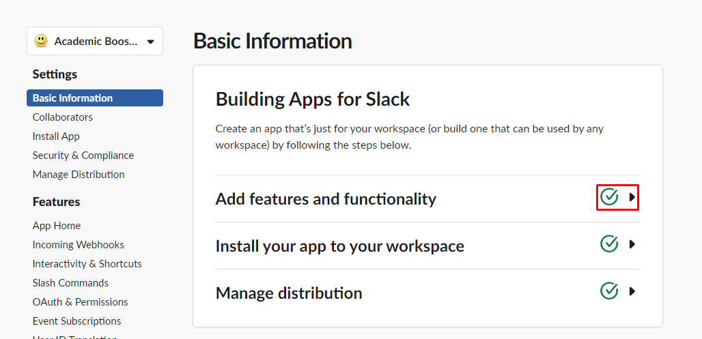
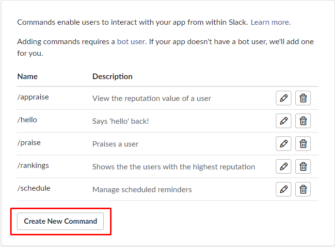
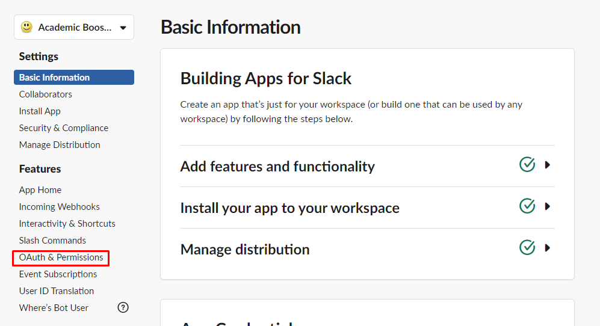
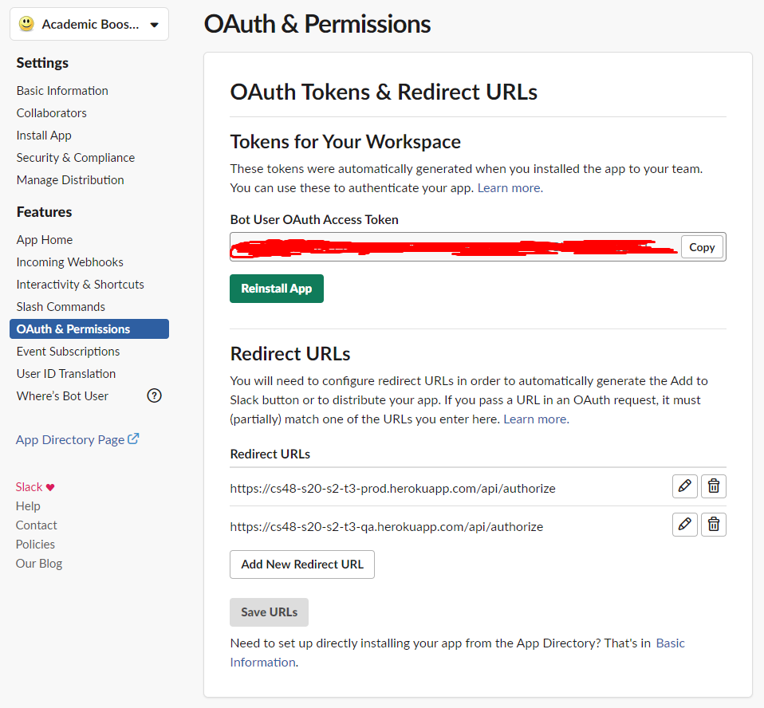
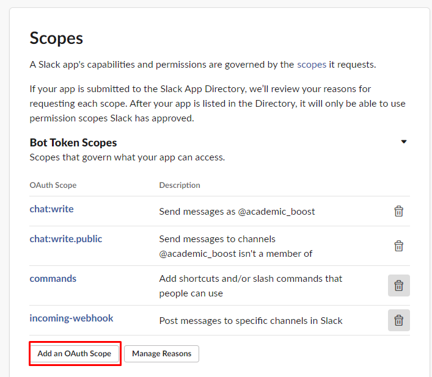

# Fork our Github repository
  
# Set up a Heroku app

# Set up a MongoDB server

# Create a Slack application
https://api.slack.com/apps

# Insert all necessary information into the .env file
After following [this tutorial](https://github.com/ucsb-cs48-s20/project-s2-t3-slack-bot/blob/master/docs/auth0-localhost.md#create-the-env-file), which explains how to set up the .env file, you will insert the following extra values.

| Key                        | Sample Value (these are just fake examples)                        |
| -------------------------- | ------------------------------------------------------------------ |
| `SLACK_CLIENT_ID`          | 123                                                                |
| `SLACK_CLIENT_SECRET`      | 123                                                                |
| `SLACK_VERIFICATION_TOKEN` | 123                                                                |
| `SLACK_AUTH_TOKEN`         | 123                                                                |
| `MONGODB_URI`              | 123                                                                |

SLACK_CLIENT_ID, SLACK_CLIENT_SECRET, SLACK_VERIFICATION_TOKEN will be found in the 
SLACK_AUTH_TOKEN will be found in 'Basic Information' of  your Slack App API page

# Set up the config vars into Heroku

# Insert the following commands into your app
Go to the Slack Applications link given [here](https://api.slack.com/apps). Then, click on your app.
Now, you should be at the "Basic Information" page. 

 From here, click on "Add features and functionality".

 Then, click on "Slash Commands".

 Now, you can make the commands. To create a command, go to "Create New Command" and input
the the following:

| Command       | Request URL (Example URLs)          | Short Description            | Usage Hint                |
| ------------- | ----------------------------------- | ---------------------------- | ------------------------- |
| /appraise     | cgaucho.herokuapp.com/api/appraise  | Shows reputation             | [User]                    |
| /hello        | cgaucho.herokuapp.com/api/hello     | Messages hello back          |                           |
| /praise       | cgaucho.herokuapp.com/api/praise    | Gives people 1 rep           | [User]                    |
| /rankings     | cgaucho.herokuapp.com/api/rankings  | Shows most reputable         |                           |
| /schedule     | cgaucho.herokuapp.com/api/schedule  | Sends messages at given time | [Create/Delete/List/Help] |

The short description and usage hint doesn't impact how the command works, so feel free to skip that step.

# Add the following Redirect URLs and Bot Token Scopes in your Slack application

Return to the home page. Now, go to the "OAuth & Permissions" tab.
 

 Click on "Add New Redirect URL" and your redirect URL. An example of what the website should look like is cgaucho.herokuapp.com/api/authorize
 

  Then, scroll down until you get to the box named "Scopes". Click on OAuth Scopes and add the scopes in the following image:
 
